# Online Shop Project

## Overview

This is an online shop application designed to provide a seamless shopping experience. It is built with a modern tech stack, utilizing **NestJS** for the backend and **React.js** for the frontend. The project is designed to handle a large number of users efficiently and securely.

## Images

### Homepage
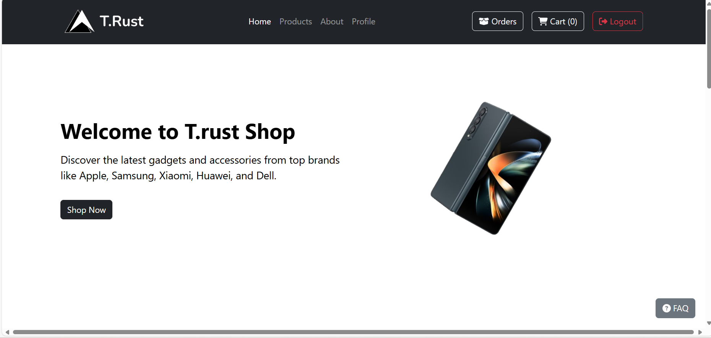

### Homepage (Alternative View)
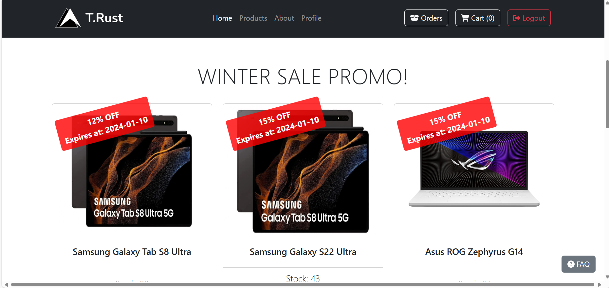

### Product Details
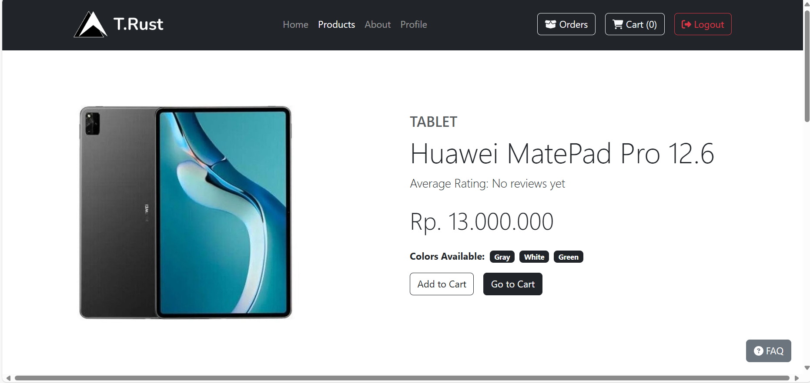
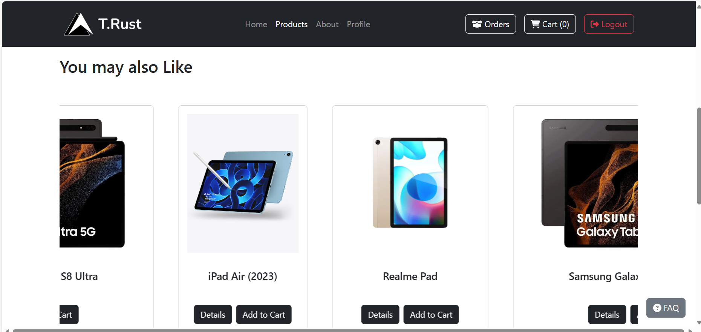
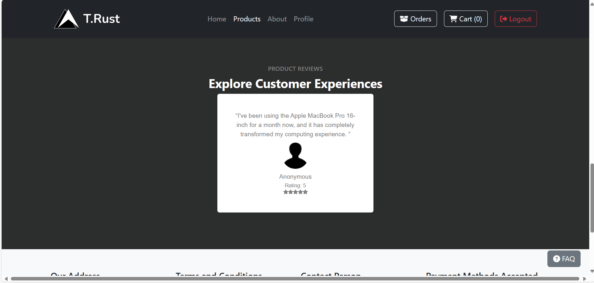

### Cart
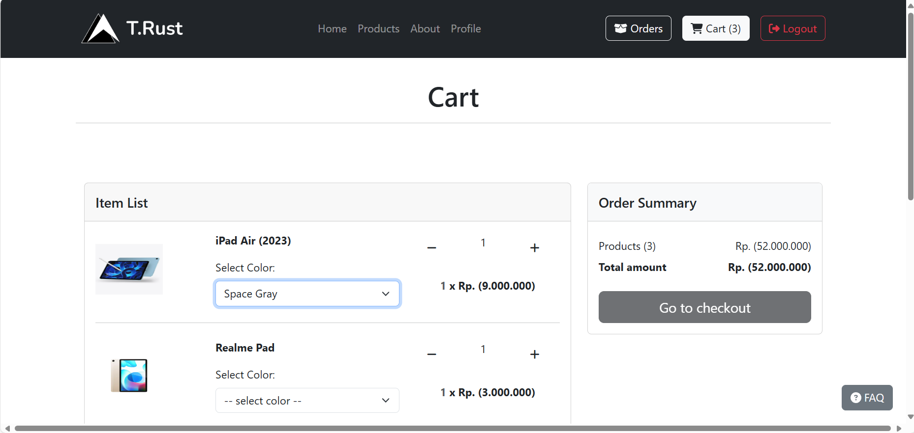

### Checkout
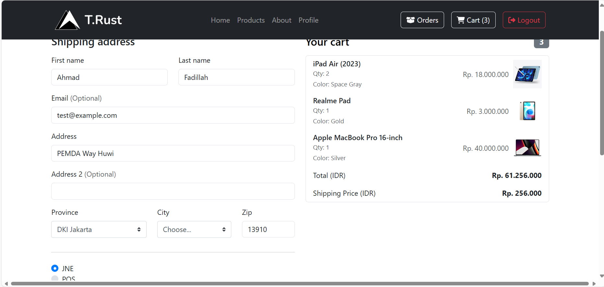

### User Profile
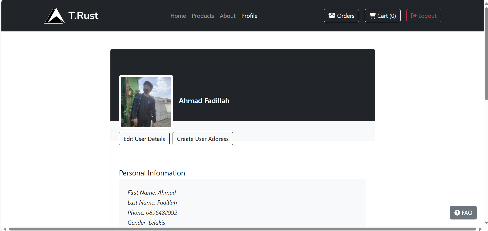

### Login and Registration
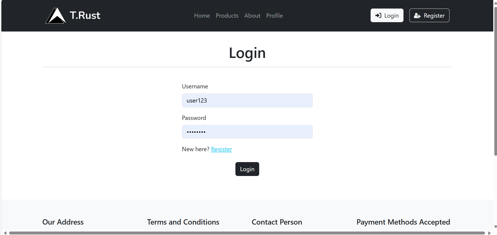
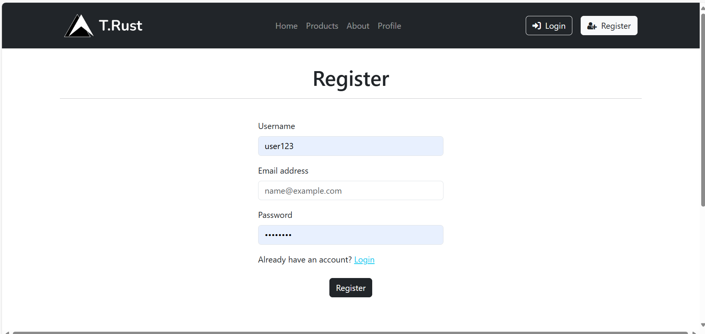

### Terms and FAQ
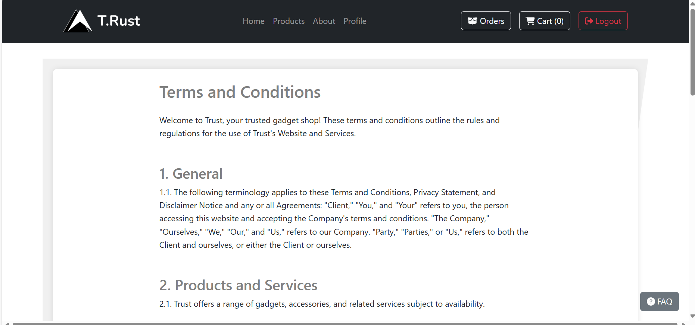
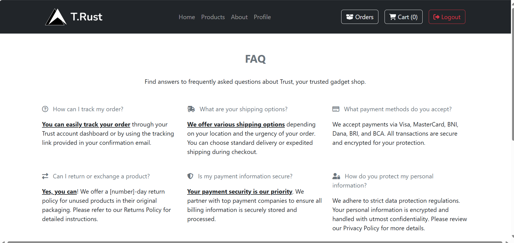

### Order Details
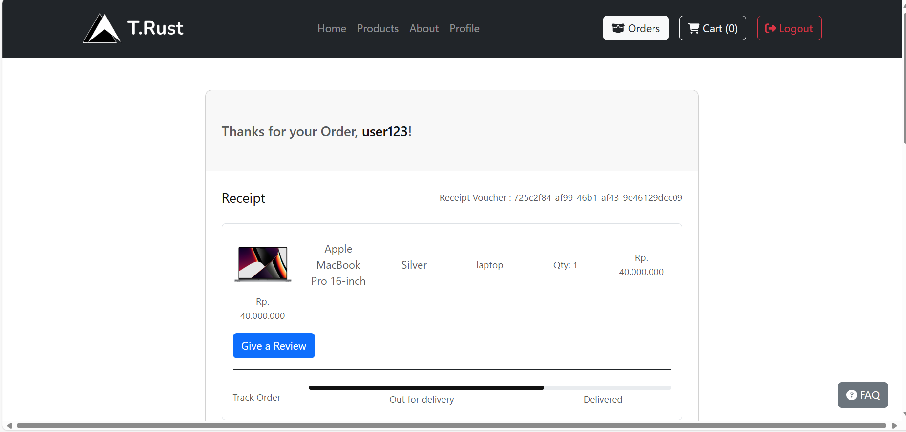
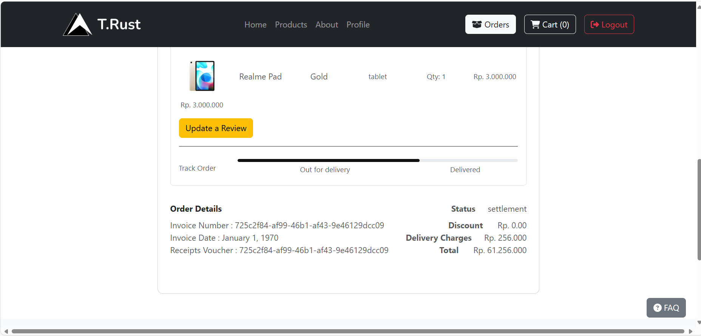

### Product Review
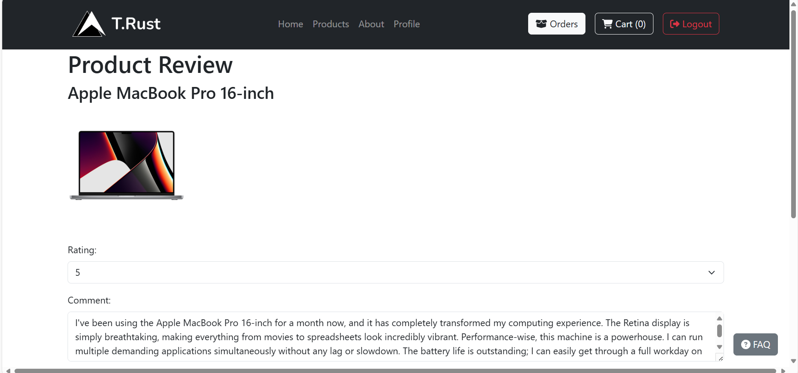


## Table of Contents

- [Online Shop Project](#online-shop-project)
  - [Overview](#overview)
  - [Images](#images)
    - [Homepage](#homepage)
    - [Homepage (Alternative View)](#homepage-alternative-view)
    - [Product Details](#product-details)
    - [Cart](#cart)
    - [Checkout](#checkout)
    - [User Profile](#user-profile)
    - [Login and Registration](#login-and-registration)
    - [Terms and FAQ](#terms-and-faq)
    - [Order Details](#order-details)
    - [Product Review](#product-review)
  - [Table of Contents](#table-of-contents)
  - [Features](#features)
  - [Tech Stack](#tech-stack)
    - [Backend](#backend)
    - [Frontend](#frontend)
  - [Folder Structure](#folder-structure)
  - [Getting Started](#getting-started)
    - [Prerequisites](#prerequisites)
    - [Installation](#installation)
    - [Running the Project](#running-the-project)
  - [Contributing](#contributing)
  - [License](#license)

## Features

- User authentication with JWT
- Product management
- Cart and order management
- Secure payment processing via Midtrans
- Rate limiting and throttling for enhanced security
- Responsive design for various devices

## Tech Stack

### Backend

- **[NestJS](https://nestjs.com/)** - A progressive Node.js framework for building efficient, reliable, and scalable server-side applications.
- **TypeORM** - An ORM for TypeScript and JavaScript (ES7, ES6, ES5).
- **MySQL** - A relational database management system.
- **Redis** - An in-memory data structure store, used as a database, cache, and message broker.
- **JWT** - JSON Web Tokens for secure user authentication.
- **Rate Limiter** - Controls the rate of requests to prevent abuse.
- **Throttler** - Adds an extra layer of rate limiting to ensure fair usage.
- **Midtrans** - Payment gateway integration for handling transactions.

### Frontend

- **[React.js](https://reactjs.org/)** - A JavaScript library for building user interfaces.
- **Bootstrap 5** - A popular CSS framework for responsive web design.
- **Redux** - A predictable state container for JavaScript apps.

## Folder Structure
```
online-shop/
│
├── assets/               # Contains static assets like images and icons
│   ├── about.png
│   ├── cart.png
│   └── ... (other images)
│
├── backend/              # Backend application files
│   ├── src/
│   ├── .env
│   └── ... (other backend files)
│
├── frontend/             # Frontend application files
│   ├── public/
│   ├── src/
│   └── ... (other frontend files)
│
├── .gitmodules           # Git submodules configuration
├── docker-compose.yml    # Docker Compose file for container orchestration
└── T. rust API BACKEND.postman_collection.jso  # Postman collection for API testing
```

## Getting Started

### Prerequisites

Make sure you have the following installed:

- **Node.js** (>=14.x)
- **npm** or **yarn**
- **Docker** and **Docker Compose**
- **MySQL** server
- **Redis** server

### Installation

1. **Clone the repository:**

    ```bash
    git clone https://github.com/Ahmdfdhilah/gadget_store
    cd gadget_store
    ```

2. **Backend setup:**

    ```bash
    cd backend
    npm install
    cp .env.example .env
    # Update .env with your database and Redis credentials
    ```

3. **Frontend setup:**

    ```bash
    cd ../frontend
    npm install
    ```

4. **Run Docker containers:**

    ```bash
    cd ..
    docker-compose up -d
    ```

### Running the Project

1. **Start the backend server:**

    ```bash
    cd backend
    npm run start:dev
    ```

2. **Start the frontend server:**

    ```bash
    cd ../frontend
    npm start
    ```

3. Open your browser and navigate to `http://localhost:3001` for the frontend.

## Contributing

Contributions are welcome! Please follow the [contribution guidelines](CONTRIBUTING.md) for this project.

## License

This project is licensed under the MIT License - see the [LICENSE](LICENSE) file for details.